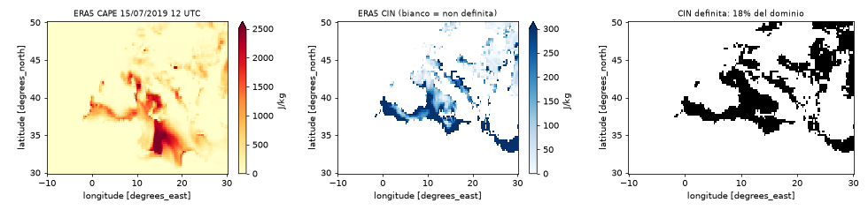
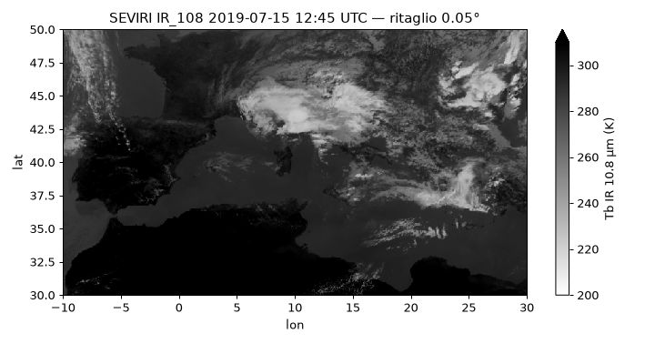
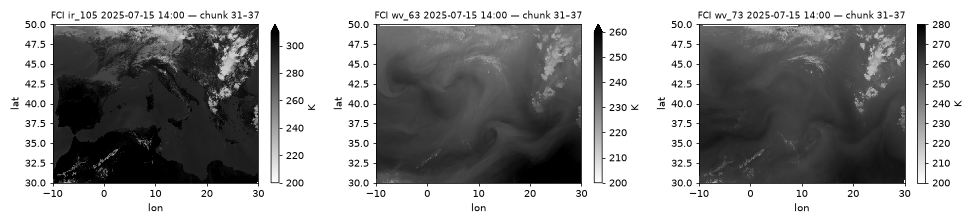
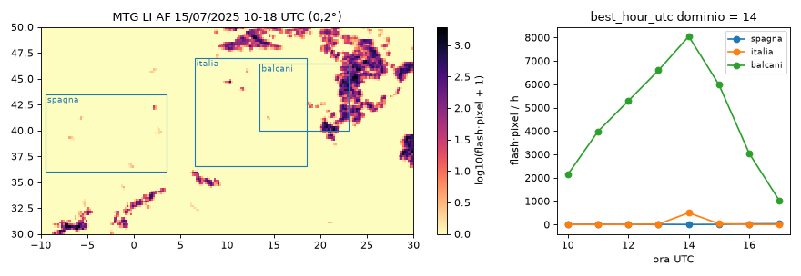
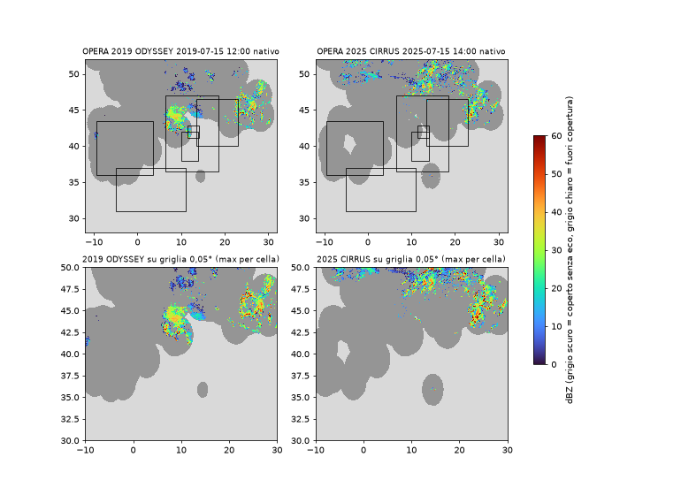
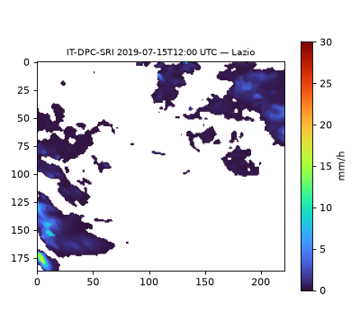
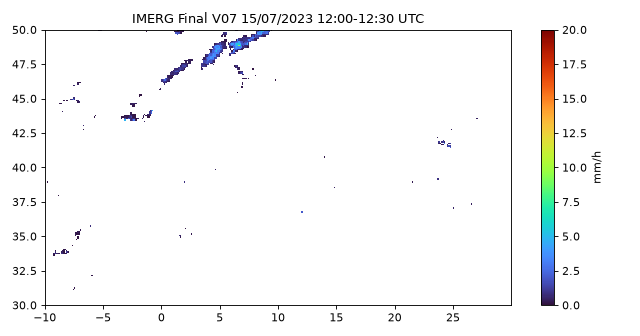
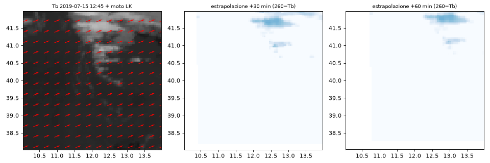

# IA meteo — Fase 0: smoke test

Generato da `smoke/make_report.py` dai JSON in `smoke/results/`. Esecuzione 07–08/10/2026 sul Mac (Apple Silicon, 8 GB), ambiente conda `ia_meteo`, codice delle fonti in `ia_meteo/fonti/`. Nessuna conclusione sulle scelte del planning: solo misure e decisioni aperte.

## 1. Tabella riassuntiva

| Test | Esito | Tempo (s) | MB scaricati | Risposta |
|:--|:--|--:|--:|:--|
| s1_seviri | **OK** | 201 | 740.6 | 4 prodotti in 1 h; 4/4 scaricati e letti; zip medio 185.2 MB, .nat 271.2 MB, download medio 23.5 s; IR_108 217.8–327.0 K; ritaglio 3 canali 0,05° compresso 1.82 MB; Data Tailor: DONE (55.6 s, 7.3 MB) |
| s2_fci | **OK** | 460 | 180.4 | Sì: entry scaricabili singolarmente (Product.open(entry=...)). Chunk 31–37 = 179 MB contro 1103 MB del disco intero (16%), TRAIL non necessario; ritaglio 3 canali, ir_105 217.6–325.5 K; Data Tailor: DONE |
| s3_li_flashes | **OK** | 105 | 167.5 | 48/48 prodotti da 10 min letti (167.5 MB solo BODY); griglia sparsa su geostazionaria FCI 2 km; best_hour_utc 14:00 (36576 flash·pixel nel dominio); griglia 0,05° conserva il 100.00% del totale |
| s4_opera | **OK** | 11 | 3.4 | 2019 ODYSSEY: spagna 96.2%, italia 45.7%, balcani 58.7%, lazio 38.6%, tirreno 23.8%, nord_africa 23.7% / 2025 CIRRUS: spagna 91.2%, italia 60.2%, balcani 73.9%, lazio 54.1%, tirreno 23.6%, nord_africa 20.4% |
| s5_openmeteo_env | **OK** | 1 | 0.012 | ecmwf_ifs 2019-07-15: CAPE 0/24, CIN 0/24, LI 0/24, W500 0/24, T2m(controllo) 24/24, passo None h; ecmwf_ifs025 2024-07-15: CAPE 24/24, CIN 0/24, LI 0/24, W500 24/24, T2m(controllo) 24/24, passo 1 h; ncep_gfs_seamless 2022-07-15: CAPE 24/24, CIN 24/24, LI 24/24, W500 24/24, T2m(controllo) 24/24, passo 1 h; gfs_seamless 2022-07-15: CAPE 24/24, CIN 24/24, LI 24/24, W500 24/24, T2m(controllo) 24/24, passo 1 h; ecmwf_ifs 2024-07-15: CAPE 0/24, CIN 0/24, LI 0/24, W500 0/24, T2m(controllo) 24/24, passo None h |
| s6_era5_cds | **OK** | 10 | 0.857 | 15/15 variabili (cape, cin, kx, totalx, tcwv, deg0l, blh, sst, cp, u10, v10, u, v, t, r), griglia 81×161, 9.5 s totali (nessuna coda: risultato già in cache CDS), 0.86 MB |
| s7_it_dpc_sri | **OK** | 10 | 17.9 | Sì: Zarr anonimo su EWC (https://object-store.os-api.cci2.ecmwf.int), apertura lazy 3.18 s, timestep 2019-07-15T12:00 sul Lazio letto in 2.96 s (0.17 MB di dati + 17.73 MB di coordinate una tantum); Zenodo ha solo il tar.zst da 49.83 GB |
| s8a_imerg | **OK** | 8 | 7.86 | login OK; 3B-HHR.MS.MRG.3IMERG.20230715-S120000-E122959.0720.V07B.HDF5: 7.86 MB, variabile 'precipitation' (mm/hr), 0.1°; V08 su CMR: 0 granuli, versioni collezione ['07'] |
| s8b_huggingface | **OK** | 2 | 0 | dataset privato Fil728/ia-meteo-events: creato=True, privato=True, upload+verifica+cancellazione riusciti; file rimasti: ['.gitattributes'] |
| s9_toolchain | **OK** | 20 | 0 | Sì: LK + estrapolazione +30/+60 min in 0.1 s su [4, 80, 80], processo intero 19.8 s (incl. import e richiesta ERA5), picco RAM 340.3 MB; moto nubi fredde 64.9 km/h da 248°; ERA5 850–500 hPa 30.0 km/h da 269° |
| s10_cape_cin | **OK** | 8 | 8.93 | ERA5: CAPE e CIN presenti in tutti gli anni 2015–2025 (11/11); CIN definita in media sul 12% del dominio (NaN altrove, CAPE max dove CIN è NaN = 4568 J/kg; CIN mancante nel 46% dei punti con CAPE > 500); evento 12 h: 8.2 MB compressi in 3.8 s; CIN in tempo reale da: ncep_gfs_seamless, ecmwf_ifs, icon_seamless, italia_meteo_arpae_icon_2i |
| s11_archivio_hf | **OK** | 218 | 1333.2 | Sì: 2 finestre di prova costruite, caricate (1 commit ciascuna), verificate, cancellate dal Mac e riscaricate identiche; MB per finestra {'prova_20190715T12': 6.45, 'prova_20250715T14': 4.55}; spazio HF account 0.011 → 0.011 → 0.011 GB dopo pulizia e compattazione |
| s12_archivio_catalogo | **OK** | 4 | 23.0 | Sì: catalogo era5_2019_07 (744 ore, 21.2 MB, CDS 445.6 s) già su HF da una sessione precedente: ripreso senza nuova richiesta CDS; presente() lo riconosce; mini-finestra caricata e riscaricata identica (anche solo radar); LRU ha tolto prima catalogo/era5_2019_07.nc |

Tempo = somma delle fasi misurate (S9: processo intero). Le richieste CDS ripetute possono uscire dalla cache del CDS e risultare più veloci della prima esecuzione.

## 2. Risposte ai "da verificare" del planning

### Quote e rate limit API EUMETSAT

Nessun HTTP 429 in oltre 200 download (SEVIRI, LI, entry FCI, richieste Range da 1 byte) né header `X-RateLimit-*` sulle API Data Store. Data Tailor: quota disco utente 20 000 MB per gli output delle customizzazioni (endpoint quota, 08/10/2026); 3 customizzazioni SEVIRI in parallelo accettate (145 s in tutto). Un limite giornaliero ufficiale non è esposto dall'API.

### FCI: download per chunk e Data Tailor

- **Download per chunk: sì.** Ciclo 2025-07-15 14:00:07 – 2025-07-15 14:09:34. 61 entry (40 BODY, 1 TRAIL, 20 quicklook/metadati). Chunk 31–37 = **179.1 MB** contro **1102.7 MB** del disco intero. Ritaglio 3 canali (ir_105 217.6–325.5 K), NaN 0.56% (sottile striscia sul bordo nord-ovest), 2.07 MB compresso.
- Righe reali (ir_105, da sud): 31: 4196–4324, 32: 4325–4454, 33: 4455–4593, 34: 4594–4732, 35: 4733–4872, 36: 4873–5011, 37: 5012–5150.
- MB per chunk (1→40): 3.9, 10.2, 15.3, 19.3, 22.1, 24.3, 25.5, 26.9, 27.5, 27.9, 27.9, 29.6, 30.7, 32.5, 33.7, 33.2, 32.9, 32.5, 33.2, 35.0, 36.0, 36.3, 37.8, 37.1, 36.6, 37.7, 35.8, 34.8, 31.9, 29.1, 28.2, 26.4, 26.8, 25.5, 24.9, 24.6, 22.6, 18.3, 13.0, 4.6.
- **Data Tailor su FCI: sì** (`FCIL1FDHSI`, `netcdf4`, ROI dominio, radianza ir_105): DONE, 280.4 s lato server, 5.5 MB.

### Data Tailor su SEVIRI (non chiesto dal brief, utile per i volumi)

- `HRSEVIRI`, canali 5/6/9 (WV 6,2, WV 7,3, IR 10,8), ROI dominio: DONE, 55.6 s, **7.3 MB** contro ~185 MB dello zip. Output in radianza, griglia geostazionaria {'y': 507, 'x': 1193}. Conversione in Tb da implementare.

### Risoluzione della griglia LI

- sparsa (pixels) su griglia geostazionaria FCI 5568×5568 (area satpy mtg_fci_fdss_2km), ≈2 km al nadir, ~3-4 km a 40-45°N.
- 20 accumuli per file, durata 600 s, unità `flashes/pixel`. best_hour_utc = **14**. Sulla griglia 0,05° si conserva il 100.00% dei flash del dominio.

| Ora UTC | dominio | spagna | italia | balcani |
|:--|--:|--:|--:|--:|
| 10 | 19406.4 | 0.0 | 0.0 | 2132.5 |
| 11 | 34109.5 | 5.1 | 0.0 | 3979.3 |
| 12 | 33386.3 | 0.0 | 0.0 | 5283.5 |
| 13 | 32867.3 | 5.0 | 15.1 | 6593.2 |
| 14 | 36576.3 | 0.0 | 498.2 | 8049.0 |
| 15 | 30561.3 | 4.8 | 30.1 | 5977.3 |
| 16 | 23922.5 | 26.5 | 5.2 | 3039.1 |
| 17 | 24124.3 | 30.1 | 0.0 | 1009.9 |

Valori in flash×pixel per ora.

### Copertura OPERA per zona (% pixel non `nodata`; `undetect` = valido)

| Composito | spagna | italia | balcani | lazio | tirreno | nord_africa | risoluzione | griglia | MB |
|:--|--:|--:|--:|--:|--:|--:|:--|:--|--:|
| 2019 ODYSSEY (20190715 120000) | 96.2 | 45.7 | 58.7 | 38.6 | 23.8 | 23.7 | 2 km | 1900×2200 | 0.75 |
| 2025 CIRRUS (20250715 140000) | 91.2 | 60.2 | 73.9 | 54.1 | 23.6 | 20.4 | 1 km | 3800×4400 | 2.64 |

Proiezione: `+proj=laea +lat_0=55.0 +lon_0=10.0 +x_0=1950000.0 +y_0=-2100000.0 +units=m +ellps=WGS84`.

### CAPE/CIN/livelli di pressione nello storico (Open-Meteo Historical Forecast)

Ore non nulle su 24, Roma Sud (41.73, 12.35):

| Modello giorno | cape | convective inhibition | lifted index | freezing level height | wind speed 500hPa | temperature 850hPa | relative humidity 700hPa | temperature 2m |
|:--|--:|--:|--:|--:|--:|--:|--:|--:|
| ecmwf_ifs 2019-07-15 | 0 | 0 | 0 | 0 | 0 | 0 | 0 | 24 |
| ecmwf_ifs025 2024-07-15 | 24 | 0 | 0 | 0 | 24 | 24 | 24 | 24 |
| ncep_gfs_seamless 2022-07-15 | 24 | 24 | 24 | 24 | 24 | 24 | 24 | 24 |
| gfs_seamless 2022-07-15 | 24 | 24 | 24 | 24 | 24 | 24 | 24 | 24 |
| ecmwf_ifs 2024-07-15 | 0 | 0 | 0 | 0 | 0 | 0 | 0 | 24 |

### `total_column_water_vapour` in ERA5

- Presente: **sì** (`tcwv`). Variabili di `fonti.era5.fetch_env`: blh, cape, cin, cin_definita, cp, deg0l, kx, r, sst, t, tcwv, totalx, u, u10, v, v10; griglia {'time': 1, 'latitude': 81, 'longitude': 161, 'pressure_level': 4}.

### CAPE e CIN per l'addestramento (S10)

- ERA5: CAPE e CIN presenti in tutti gli anni 2015–2025 (11/11); CIN definita in media sul 12% del dominio (NaN altrove, CAPE max dove CIN è NaN = 4568 J/kg; CIN mancante nel 46% dei punti con CAPE > 500); evento 12 h: 8.2 MB compressi in 3.8 s; CIN in tempo reale da: ncep_gfs_seamless, ecmwf_ifs, icon_seamless, italia_meteo_arpae_icon_2i.
- ERA5 data documentation: 'A missing value is assigned to CIN for values of CIN > 1000 or where there is no cloud base'. Trattamento: NaN → 1000 J/kg + maschera cin_definita (fonti.era5.prepara_cin).

| Anno ora | CAPE max | CAPE>500 (% dominio) | CIN definita (% dominio) | CIN mancante dove CAPE>500 | CAPE max dove CIN manca |
|:--|--:|--:|--:|--:|--:|
| 2015-07-15T00 | 4338 | 18 | 12 | 54% | 4132 |
| 2015-07-15T12 | 4095 | 14 | 15 | 44% | 3016 |
| 2016-07-15T00 | 3385 | 7 | 10 | 26% | 1764 |
| 2016-07-15T12 | 4118 | 7 | 13 | 16% | 1979 |
| 2017-07-15T00 | 3840 | 14 | 10 | 45% | 3417 |
| 2017-07-15T12 | 3481 | 12 | 16 | 39% | 2290 |
| 2018-07-15T00 | 2702 | 16 | 18 | 43% | 1760 |
| 2018-07-15T12 | 3378 | 19 | 24 | 31% | 2445 |
| 2019-07-15T00 | 3354 | 17 | 16 | 38% | 3354 |
| 2019-07-15T12 | 3370 | 13 | 18 | 38% | 3370 |
| 2020-07-15T00 | 2282 | 11 | 16 | 16% | 1523 |
| 2020-07-15T12 | 2702 | 8 | 16 | 17% | 1496 |
| 2021-07-15T00 | 3614 | 6 | 6 | 58% | 2614 |
| 2021-07-15T12 | 4916 | 5 | 8 | 23% | 2704 |
| 2022-07-15T00 | 2987 | 5 | 6 | 42% | 2987 |
| 2022-07-15T12 | 3289 | 6 | 4 | 65% | 3289 |
| 2023-07-15T00 | 3690 | 16 | 6 | 78% | 3690 |
| 2023-07-15T12 | 3722 | 12 | 5 | 85% | 3722 |
| 2024-07-15T00 | 4289 | 21 | 8 | 77% | 4289 |
| 2024-07-15T12 | 4914 | 21 | 14 | 59% | 4568 |
| 2025-07-15T00 | 3319 | 13 | 10 | 60% | 2939 |
| 2025-07-15T12 | 2778 | 11 | 14 | 52% | 2778 |

Disponibilità in tempo reale (Forecast API, ore non nulle nelle prossime 24 h su Roma Sud):

| Modello | CAPE | CIN |
|:--|--:|--:|
| ncep_gfs_seamless | 24 | 24 |
| ecmwf_ifs025 | 24 | 0 |
| ecmwf_ifs | 24 | 24 |
| icon_seamless | 24 | 24 |
| meteofrance_seamless | 24 | 0 |
| italia_meteo_arpae_icon_2i | 24 | 24 |

Convenzioni, Roma Sud 15/07 12 UTC (ERA5 most-unstable, CIN positiva o mancante; GFS Open-Meteo, CIN negativa):

| Anno | ERA5 CAPE | GFS CAPE | ERA5 CIN | GFS CIN |
|:--|--:|--:|--:|--:|
| 2021 | 3.8 | 20.0 | mancante | 0.0 |
| 2022 | 1194.5 | 90.0 | 983.3 | -41.0 |
| 2023 | 835.8 | 460.0 | mancante | -167.0 |
| 2024 | 801.2 | 0.0 | mancante | -14.0 |
| 2025 | 130.8 | 0.0 | mancante | -11.0 |

### Accesso lazy a IT-DPC-SRI

- **Sì**: xarray.open_zarr + s3fs anonimo, endpoint https://object-store.os-api.cci2.ecmwf.int, s3://mlcast-source-datasets/IT-DPC-SRI/v0.1.0/italian-radar-dpc-sri.zarr.
- Dims {'time': 1039785, 'y': 1400, 'x': 1200, 'missing_times': 15530}; periodo ['2010-01-01T00:00', '2025-12-31T23:55']; chunk [1, 1400, 1200].
- Timestep 2019-07-15T12:00 sul Lazio ([187, 222] px) in 2.96 s: 0.17 MB di dati + 17.73 MB di coordinate (una tantum).

### Stato IMERG V08

- https://gpm.nasa.gov/data/news/imerg-v08-transition-schedule (28/04/2026): V07 Final termina a settembre 2025; V08 Final prevista nell'estate 2026, retroprocessata dal 1998; Late/Early in modalità 'hybrid V07'
- CMR (08/10/2026): granuli per versione {'07': 1, '08': 0}; versioni collezione ['07'] → **V08 non ancora pubblicata**.

## 3. Spazio e tempi per i test reali (da `stima_spazio.py`)

Parametri del planning: finestre da 12 h, 150–300 finestre, griglia 0,05°, canali IR 10,8 + WV 6,2/7,3. Ipotesi esplicite: 15% finestre FCI (2025), 15% laziali con IT-DPC-SRI, 3 download in parallelo.

**Peso compresso di un frame sulla griglia comune** (MB): seviri_3canali_f32 1.857, seviri_3canali_i16 1.016, opera_2019_f32 0.058, opera_2025_f32 0.062, li_10min_f32 0.05, imerg_30min 0.028, itdpc_lazio_5min 0.057.

| Per finestra da 12 h | conservati float32 (MB) | conservati int16 (MB) |
|:--|--:|--:|
| seviri | 100.8 | 60.4 |
| seviri_cirrus | 106.9 | 66.6 |
| fci | 170.4 | 102.9 |
| lazio_extra | 8.2 | 8.2 |

Scaricati per finestra: SEVIRI disco intero 8887 MB (planning: ~5 600), SEVIRI via Data Tailor 350 MB, FCI solo chunk 12895 MB, FCI disco intero 79394 MB.

| Scenario | finestre SEVIRI / FCI / Lazio | conservati float32 | conservati int16 | scaricati (rete) | scaricati con Data Tailor SEVIRI | ore di download (3 worker) |
|:--|:--|--:|--:|--:|--:|--:|
| 150 finestre | 128 / 22 / 22 | 16.9 GB | 10.3 GB | 1421 GB | 329 GB | 20 h |
| 300 finestre | 255 / 45 / 45 | 33.9 GB | 20.6 GB | 2847 GB | 670 GB | 40 h |

Le ore con 3 worker presuppongono che la linea regga 3 download insieme (~9 MB/s ciascuno misurati qui); in sequenza sono 59 h (150) e 119 h (300). Il Data Tailor SEVIRI riduce la rete di ~25 volte ma costa ~50 s di elaborazione lato server per slot.

**Spazio sul Mac** (i dati scaricati non restano: ogni slot si ritaglia e si cancella):

- Lavoro durante il download: ~1.37 GB (3 worker × zip+.nat SEVIRI).
- Catalogo eventi ERA5 della Fase 1 (CAPE, CIN, precipitazione convettiva, orari, apr–nov 2015–2025): ~1.9 GB (88 mesi; misurato su un mese reale in S12), da tenere su HF: sul Mac c'è al più un mese. Tempo CDS in sequenza ~10.9 h.
- Ambiente conda: ~1.6 GB (già installato).
- Dataset ritagliato: da 10.3 GB (150 finestre, int16) a 33.9 GB (300 finestre, float32) se resta tutto in locale; ~0 se ogni finestra va su Hugging Face (privato, limite 100 GB) e si cancella dal Mac.

## 3b. Modalità d'archivio: Mac a tetto fisso, finestre su Hugging Face (S11)

`finestra.py` costruisce la finestra in `data/staging/<id>/` scaricando un prodotto alla volta e cancellando il grezzo; `archivio.carica_finestra` la carica con un commit (più `registro.json`), verifica nomi e dimensioni sul repo e cancella la copia locale; `archivio.scarica_finestra` la riporta in una cache locale a tetto fisso. Limiti controllati prima di ogni passo: HF 95.0 GB (account, cronologia inclusa), `ia_meteo/data/` 12.0 GB, cache 8.0 GB, disco libero minimo 5.0 GB.

- Esito: **OK**. Sì: 2 finestre di prova costruite, caricate (1 commit ciascuna), verificate, cancellate dal Mac e riscaricate identiche; MB per finestra {'prova_20190715T12': 6.45, 'prova_20250715T14': 4.55}; spazio HF account 0.011 → 0.011 → 0.011 GB dopo pulizia e compattazione.

| Finestra | sorgenti | MB su HF | costruzione (s) | upload (s) | riscaricata identica |
|:--|:--|--:|--:|--:|:--|
| prova_20190715T12 | satellite, radar, ambiente, imerg, itdpc | 6.45 | 96.4 | 2.2 | True |
| prova_20250715T14 | satellite, radar, ambiente, imerg, fulmini | 4.55 | 121.9 | 1.8 | True |

Dettaglio per sorgente (n frame, MB scaricati, MB nel file, secondi):

- `prova_20190715T12`: satellite 4 / 740.6 / 3.86 / 60.9; radar 4 / 3.0 / 0.2 / 7.1; ambiente 2 / 1.5 / 1.44 / 2.6; imerg 2 / 16.2 / 0.06 / 14.1; itdpc 6 / None / 0.89 / 9.2
- `prova_20250715T14`: satellite 3 / 535.2 / 3.28 / 60.6; radar 6 / 15.9 / 0.32 / 33.8; ambiente 1 / 0.84 / 0.8 / 6.6; imerg 1 / 8.1 / 0.04 / 7.2; fulmini 3 / 11.9 / 0.1 / 13.7

Su HF i file eliminati restano nella cronologia: `archivio.compatta_cronologia()` la riduce a un commit. Il conteggio `used_storage` di HF si aggiorna in differita: durante S11 è rimasto a 0.011 GB sia con le finestre caricate sia dopo la pulizia. Per questo `controlla_budget` usa il massimo tra il valore HF e la somma delle voci nel registro.

### Catalogo della Fase 1 sullo stesso archivio (S12)

- Esito: **OK**. Sì: catalogo era5_2019_07 (744 ore, 21.2 MB, CDS 445.6 s) già su HF da una sessione precedente: ripreso senza nuova richiesta CDS; presente() lo riconosce; mini-finestra caricata e riscaricata identica (anche solo radar); LRU ha tolto prima catalogo/era5_2019_07.nc.
- Lettura: {'ore': 744, 'variabili': ['cape', 'cin', 'cp'], 'primo_ultimo': ['2019-07-01T00', '2019-07-31T23'], 'cape_max': 9888.0, 'cin_frac_definita': 0.189}; dopo `prepara_cin`: {'cin_nan': 0, 'cin_max': 1000.0001831054688}.
- Cache LRU con tetto di prova 0.005 GB: tolti in ordine ['catalogo/era5_2019_07.nc'].
- Registro finale: {'finestre': [], 'catalogo': ['era5_2019_07']}.

## 4. Problemi incontrati e differenze rispetto alla documentazione

- **Codice consolidato.** Tutte le soluzioni trovate stanno nel pacchetto `ia_meteo/fonti/` (`eumetsat`, `opera`, `era5`, `openmeteo`, `itdpc`, `imerg`); gli smoke test lo usano, e lo useranno i `fetch_*.py` della Fase 2. Dopo il consolidamento tutti i test sono stati rieseguiti con gli stessi risultati (08/10/2026).
- **Ambiente (B2).** `pysteps` non esiste su conda-forge per osx-arm64: installato via pip. Il wheel va compilato con OpenMP, che il clang di Apple non ha → aggiunti all'ambiente `clang_osx-arm64` e `llvm-openmp` e `CC` puntato a quel clang (procedura in testa a `environment.yml`). pysteps LK richiede anche OpenCV (`py-opencv`), non elencato nel brief. Aggiunto `h5py` per ODIM.
- **SEVIRI.** Lo zip di un disco pesa ~185 MB (il .nat dentro 271 MB), non ~116 MB come nel planning. Data Tailor su SEVIRI funziona (`HRSEVIRI`, `channel_5/6/9`, ROI dominio): 7,3 MB in ~55 s invece di 185 MB, ma l'output è in **radianza** e in proiezione geostazionaria: la conversione in Tb (calibrazione SEVIRI) va scritta e verificata contro satpy prima di usarlo.
- **LI AF.** In archivio i prodotti sono da 10 min (20 accumuli da 30 s), 1 BODY + 1 TRAIL; il BODY pesa da ~0,3 MB (mattina) a ~4 MB (pomeriggio convettivo). La prima geolocalizzazione (x/y in radianti + pyproj) dava una mappa specchiata est-ovest; adottata la convenzione del reader satpy `li_l2_nc`. `flash_accumulation` somma flash×pixel, non flash distinti. `area.get_lonlat()` sull'intera griglia 5568² esaurisce gli 8 GB: si geolocalizzano solo i pixel attivi.
- **FCI.** 61 entry per ciclo, non 41: 40 BODY + 1 TRAIL + 18 quicklook + manifest + EOPMetadata. Somma entry 1103 MB contro 973 MB dichiarati. Chunk numerati da sud (1) a nord (40); le righe reali lette dai file confermano la stima geometrica. Il TRAIL non serve a satpy. Data Tailor: `FCIL1FDHSI_NATIVE` + `netcdf4` rifiutato; `FCIL1FDHSI` + `netcdf4` + `ir_105_effective_radiance` funziona (radianza, ~4–5 min lato server).
- **OPERA.** L'API EDR MeteoGate (anonima, 200 richieste/h) serve solo la cache di 24 h (204 per il 2025; il 08/10 ha risposto 429 a limite esaurito). Lo storico è nel bucket S3 pubblico `openradar-archive` (CloudFerro). 2019: `DBZH_QIND` (ODIM 2.0, DBZH e QIND in dataset separati, 15 min, 2 km); 2025: `DBZH` (5 min, 1 km). Il composito si ferma a ~31,7°N. L'Italia non partecipa a OPERA (preprint IT-DPC-SRI). Sulla griglia comune si usa il massimo per cella (non la media).
- **Open-Meteo.** ID GFS documentato `ncep_gfs_seamless` (`gfs_seamless` è un alias). `ecmwf_ifs` storico: solo superficie (niente CAPE/CIN né livelli di pressione, anche nel 2024). `ecmwf_ifs025`: CAPE e livelli sì, CIN/LI/zero termico no.
- **ERA5 / CIN.** Documentazione ERA5: "A missing value is assigned to CIN for values of CIN > 1000 or where there is no cloud base". In S10 la CIN manca nel 46% dei punti con CAPE > 500 J/kg (fino a CAPE 4568 J/kg): il NaN non è "niente inibizione". Prima versione di `prepara_cin` riempiva con 0 (errato, corretto): ora NaN → 1000 J/kg + maschera `cin_definita`. La CAPE ERA5 è la most-unstable (particelle sotto 350 hPa). La single-levels torna come zip di 2 netCDF anche con `download_format=unarchived`. Il CDS cambia i Termini d'uso il 28/10/2026.
- **IT-DPC-SRI.** Su Zenodo c'è un solo tar.zst da 49,8 GB. Il preprint (§6.2) dà il percorso S3 anonimo sull'European Weather Cloud; `mlcast-datasets` non serve. Chunk = 1 timestep × intera Italia (~0,17 MB); la prima apertura costa ~18 MB di coordinate.
- **IMERG / HF.** V08 di `GPM_3IMERGHH` non ancora su CMR. Dataset HF `Fil728/ia-meteo-events` privato, contiene solo `.gitattributes`.
- **Gemini.** Le tre ricerche di documentazione delegate a Gemini sono andate in timeout; la documentazione è stata letta direttamente.

## Anteprime

